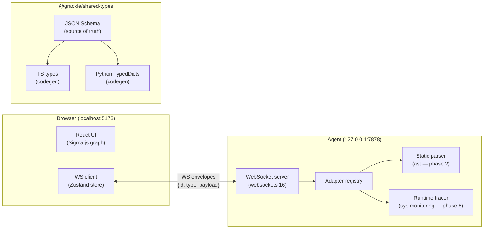

# Architecture overview

grackle is a local-first live code visualizer for Python.

## Key seams

**Transport** — JSON WebSocket envelopes. `type` is an open string; unknown
types are ignored by both sides. Schema is the source of truth (ADR-0002).

**Adapter pattern** — `StaticParserAdapter` and `RuntimeAdapter` are structural
Protocols. The registry maps language strings to implementations. New languages
plug in without touching existing code (ADR-0003, phase 1).

**Type sharing** — JSON Schema → TS + Python via codegen. Parity verified in CI
and on every schema-touching pre-commit.

## Current state (phase 0)

`grackle serve` → WebSocket server on `127.0.0.1:7878` that replies to
`ping` envelopes with `pong`. The React frontend connects automatically and
shows a live `ConnectionBadge`. Static parser, runtime tracer, and graph
rendering arrive in phases 2–7.
